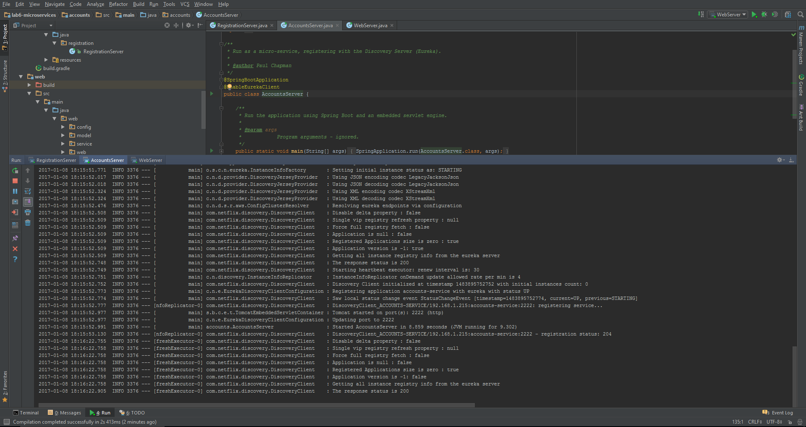
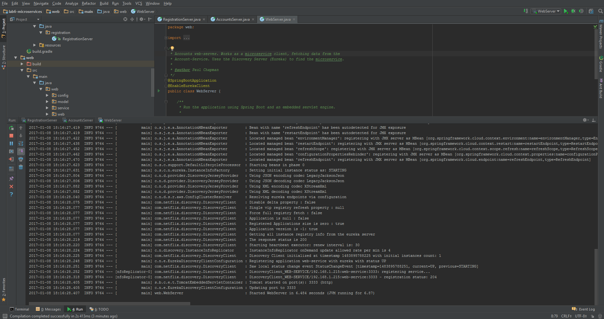
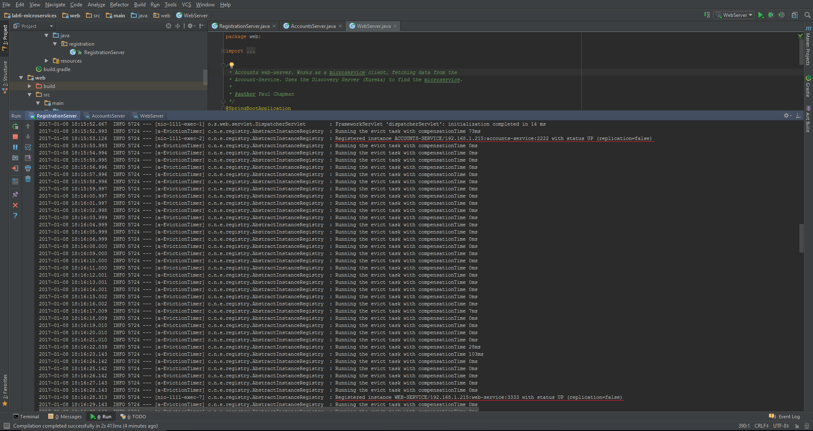
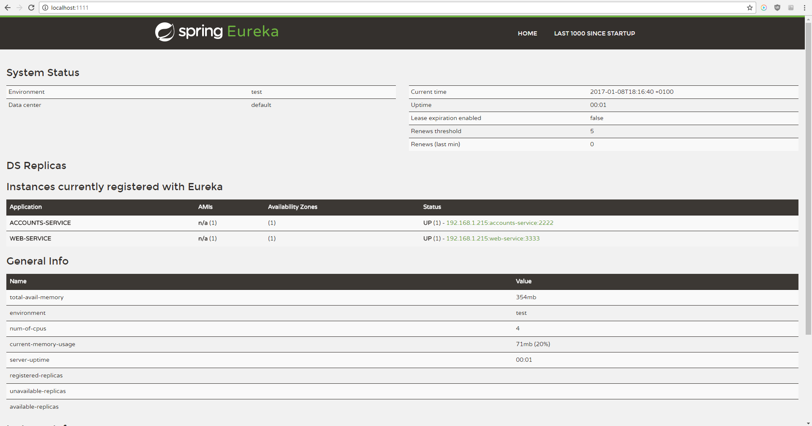
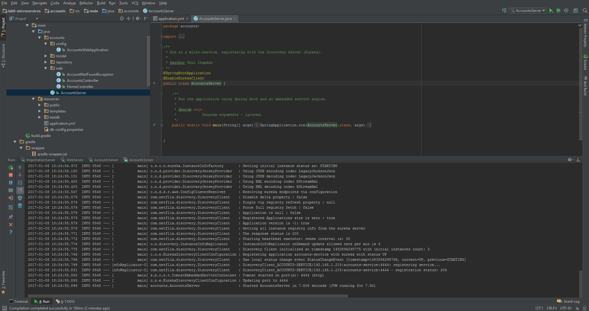
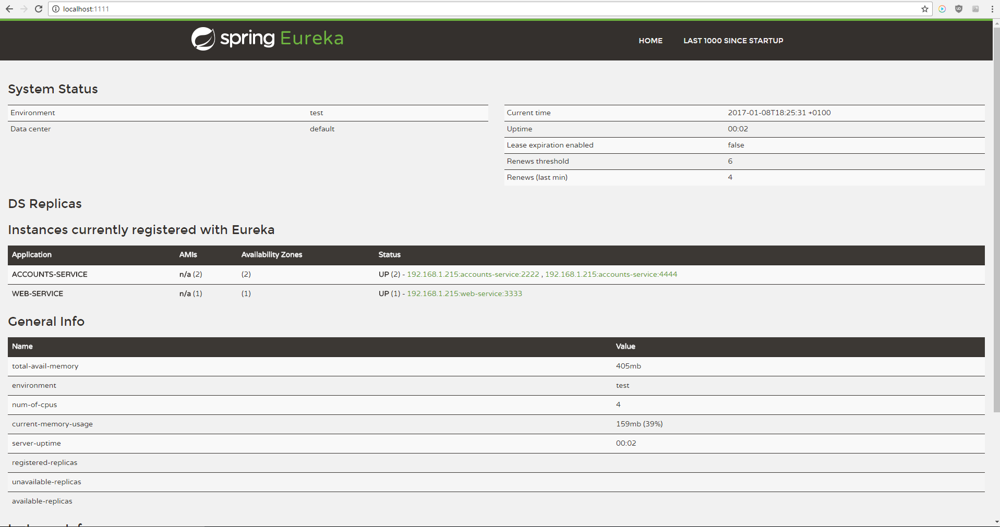

# Registering Services
Account server started and registered

Web server started and registered

Two services registered log

Two services registered dashboard

Second account server started and registered on port 4444

Three services registered dashboard

Once the microservice with por 2222 is killed, the webapp can work anyways because Eureka gives to the web service the account service on port 4444.
